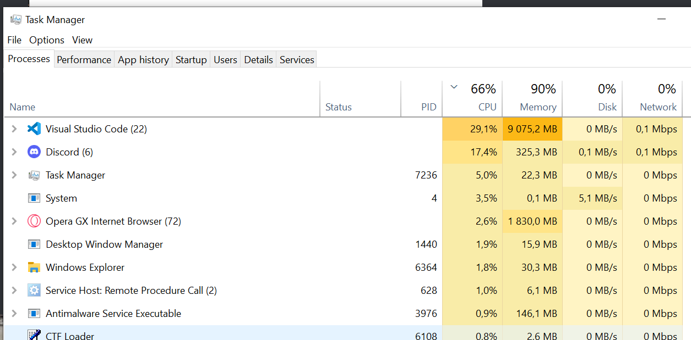

# Projet Web Title Plot Twister Tonic 
## -> TP_TTT (tp 3t) site web
# Contributors : 
### PAVARD Arthur info21A (alternance)
### [https://github.com/pavard-arthur/tpttt_siteweb](https://github.com/pavard-arthur/tpttt_siteweb)

discovery of the flask framework with an web app 
with : 
- dominate
- itsdangerous
- MarkupSafe
- visitor
- click (cli)
- python-dotenv (because SECRET_KEY should be in the .env file)
    ### **Please generate your own keys**
    ```$uuidgen```
    for CSRF (Cross-Site Request Forgery)
- PyYAML ( yaml parser for DB import)
- Werkzeug ( the python web server)
- Jinja2 ( bootstrap html render Client-Side-Rendering)
- Flask
- Bootstrap-Flask
- flask-sqlalchemy
- flask-wtf
- flask-login
- WTForms

# To Run

```bash
virtualenv -p python3 venv
source venv/bin/activate
pip install -r requirements.txt
# flask
# Commands:
#   loaddb   Creates the tables and populates them with data.
#   newuser  Adds a new user.
#   passwd   change a user passwd.
#   routes   Show the routes for the app.
#   run      Run a development server.
#   shell    Run a shell in the app context.
#   syncdb   Creates all missing tables
flask syncdb
flask loaddb
flask run
```

```bash
default login : admin passwd
```

# TODO
- [X] flask set up
- [X] bootstrap set up
- [X] DB set up
- [X] cli commands
    - [X] DB create
    - [X] DB load
    - [X] DB user create
    - [X] DB user load
    - [X] DB user change password
- [X] views
    - [X] main page samples
    - [X] book
    - [X] author
    - [ ] genres
- [X] edit
    - [X] book
    - [X] author
    - [ ] favorites
- [X] add
    - [X] book
    - [X] author
    - [X] favorites
    - [X] genres
- [X] search
    - [X] books by author
    - [X] author by books
    - [X] book search
    - [X] author search
    - [X] genres search
- [X] genres
    - [X] create genres table
    - [X] many-to-many relationship (books & genres)
    - [X] genres management (form or command)

il y a toujour des bugs ...
ll y assez peu des update git désoler 
j'ai du forcer le css avec !important
aussi "fun" fact , sur windows avec vs code
ca a réussie a bouffer 9 Gig de ram
utiliser 

CTLR pour slection plusieur genre